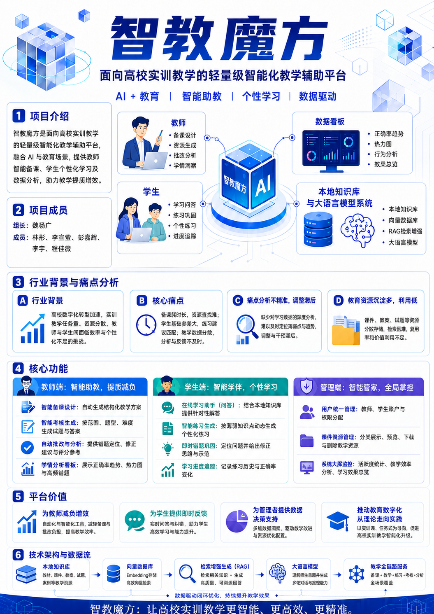
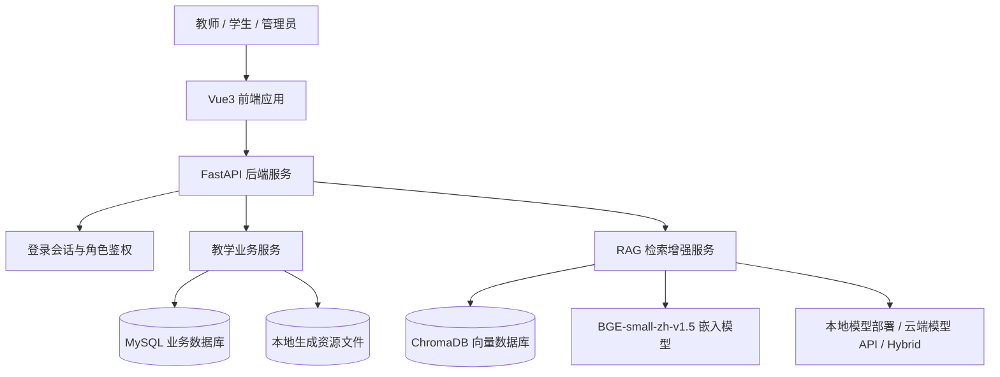
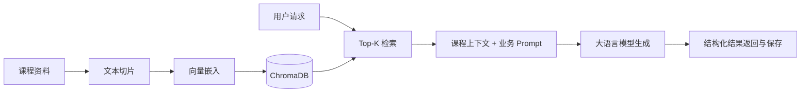
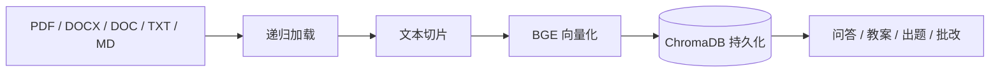
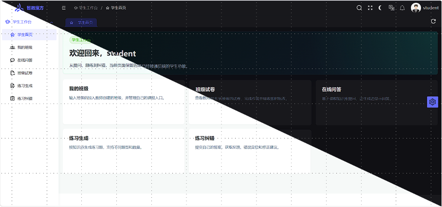

# 智教魔方

**大模型驱动的智能教学实训平台**

面向高校计算机类课程，打通“课程知识库 - 智能备课 - 智能出题 - 在线作答 - 模型批改 - 教学复盘”的教学闭环。

  
  
  
  
  

## 项目简介

智教魔方是一款面向高校实训和课程教学场景的 AI 教学辅助平台。系统以大语言模型为生成核心，以本地课程知识库为事实依据，通过 RAG（Retrieval-Augmented Generation，检索增强生成）把分散的课程资料转化为可检索、可复用、可生成的教学资产。

平台覆盖教师、学生、管理员三类角色：教师可以生成教案、生成题目、组卷并发布到班级；学生可以在线问答、完成练习或试卷并获得即时反馈；管理员可以统一管理用户、资源和系统运行数据。

## 目录

- [智教魔方](#智教魔方)
  - [项目简介](#项目简介)
  - [目录](#目录)
  - [成员信息](#成员信息)
  - [项目海报](#项目海报)
  - [行业背景与痛点](#行业背景与痛点)
  - [功能特性](#功能特性)
  - [系统架构](#系统架构)
  - [技术栈](#技术栈)
  - [知识库与模型](#知识库与模型)
    - [课程知识库](#课程知识库)
    - [模型配置](#模型配置)
  - [项目特色](#项目特色)
  - [典型场景](#典型场景)
    - [教师快速完成一节课的备课](#教师快速完成一节课的备课)
    - [教师基于教案生成试卷并发布](#教师基于教案生成试卷并发布)
    - [学生围绕薄弱知识点自测](#学生围绕薄弱知识点自测)
    - [管理员统一管理教学资源](#管理员统一管理教学资源)
  - [当前完成情况](#当前完成情况)
  - [后续规划](#后续规划)

## 成员信息

- **组长**：魏杨广(Fadedwind1)
- **成员**：
	- 林彤
	- 李宣莹(happy-16)
	- 彭嘉辉(sumikkys)
    - 李宇
    - 程佳薇

## 项目海报

  

## 行业背景与痛点

教育数字化正在从“资源上网”进入“智能协同”阶段。高校计算机类课程具有知识更新快、实验任务多、实践反馈频繁等特点，传统教学工具往往只能解决资料发布和成绩记录问题，难以进一步支持备课生成、过程指导、智能批改和数据复盘。

随着开源大模型、向量数据库和本地化部署技术逐渐成熟，低成本构建“课程知识库 + 大模型”的教学助手成为可能。对于课程团队而言，关键不再只是能否调用大模型，而是如何让模型真正理解本校课程资料、服务具体教学流程，并将教师经验持续沉淀为可复用资产。

智教魔方主要面向以下教学痛点：

- **教师备课与出题成本高**：教案设计、案例编写、课堂练习和考核题准备需要大量重复劳动，课程资料分散在课件、实验指导书、笔记和历史题目中，检索和整理成本高。
- **学生实训过程缺少即时反馈**：学生在学习或实验中遇到问题时，往往需要等待教师统一讲解；练习提交后的反馈也容易滞后。
- **教学数据难以形成闭环**：课堂、练习、试卷和批改结果经常分散在不同系统或文档中，教师难以及时掌握班级整体表现和学生薄弱环节。
- **课程资源沉淀不足**：已有课程文档大多是静态文件，难以被智能检索和生成任务直接调用，优质教案和考核题也缺少统一复用机制。

## 功能特性

| 角色 | 核心能力 | 说明 |
| --- | --- | --- |
| 教师端 | 智能备课 | 根据课程主题、教学目标、难度和课时要求生成结构化教案，支持流式生成、保存、编辑、删除和二次修订 |
| 教师端 | 智能出题与组卷 | 支持练习/考核题生成、题集历史查看、从教案生成试卷、追加题目、编辑试卷和发布到班级 |
| 教师端 | 班级与结果管理 | 支持创建班级、生成班级码、查看成员、移除成员、解散班级、查看学生提交结果 |
| 学生端 | 在线问答 | 基于课程知识库进行检索增强问答，支持普通响应和流式响应 |
| 学生端 | 练习与试卷作答 | 支持生成个性化练习、提交练习答案、查看班级试卷、在线作答并获得模型反馈 |
| 管理端 | 用户与资源管理 | 支持管理员创建/查看账号、管理教案/测验/练习等资源、查看基础数据看板 |

## 系统架构

## 技术栈

| 层次 | 技术 |
| --- | --- |
| 前端 | Vue3、Vite、TypeScript、Naive UI、Pinia、Axios |
| 后端 | FastAPI、Uvicorn、Pydantic、SQLAlchemy Async |
| 数据库 | MySQL、ChromaDB、本地 Markdown 文件存储 |
| AI / RAG | OpenAI-compatible API、BAAI/bge-small-zh-v1.5、LangChain、Sentence Transformers |
| 文档处理 | PDF、DOCX、DOC、TXT、Markdown 递归加载与切片 |

## 知识库与模型

### 课程知识库

当前知识库已覆盖多类计算机课程和实验主题，包括：

- 数据结构、操作系统、计算机网络、数据库原理、计算机组成原理
- 编译原理、软件工程、机器学习、人工智能导论、离散数学
- Linux、网络实验、数据库实验、操作系统实验、计算机组成原理实验

知识库构建流程：

### 模型配置
系统同时支持兼容 OpenAI API 的远程模型服务，可在本地推理、远程 API 和混合模式之间切换，以适配不同硬件资源、响应速度和生成质量需求。

## 项目特色

1. **从 AI 问答扩展到教学流程**
   - 平台不只是聊天式问答，而是覆盖备课、出题、组卷、发布、作答、批改和复盘。

2. **课程知识库增强生成**
   - 通过 ChromaDB 和 BGE 嵌入模型，将本地课程资料转化为模型可检索的知识来源，使生成结果更贴近课程语境。

3. **生成资源可沉淀、可复用**
   - 教案、练习和考核题不是一次性输出，而是作为教学资源进入统一管理流程，便于后续编辑、回看和复用。

4. **结构化教学数据支撑复盘**
   - 班级、试卷、题目、学生答案和评分反馈形成数据链路，为后续扩展学情分析、知识点掌握画像和教学质量评估打下基础。

  

## 典型场景

### 教师快速完成一节课的备课

教师输入课程主题、教学目标、难度和课时要求，系统从知识库检索相关课程材料，生成包含知识点讲解、课堂活动、实验任务、练习建议和时间安排的教学计划。教师可以继续编辑或要求系统二次修订，最终保存为可复用教案资源。

### 教师基于教案生成试卷并发布

教师选择已有教案或课程主题，系统自动生成结构化题目。教师将题目加入试卷，调整分值和题目顺序后发布到指定班级。学生在班级试卷页面完成作答，系统返回评分和反馈，教师可以查看提交结果。

### 学生围绕薄弱知识点自测

学生选择某个知识点或输入学习问题，平台可以提供课程知识库增强的解释，也可以生成针对性练习。学生提交答案后，系统给出得分、错误分析和修改建议，帮助学生快速定位问题。

### 管理员统一管理教学资源

管理员可以查看系统用户、教学资源和看板指标，了解平台使用情况和资源沉淀情况。后续可进一步扩展到课程级、班级级、知识点级的数据分析。

## 当前完成情况

| 模块 | 完成情况 |
| --- | --- |
| 登录与角色区分 | 已具备管理员、教师、学生角色与基础会话能力 |
| 教师智能备课 | 已支持生成、流式生成、保存、查看、编辑、删除、修订 |
| 教师题目生成 | 已支持考核/练习类题目生成、结构化保存与历史查看 |
| 班级管理 | 已支持创建班级、加入班级、退出班级、移除成员、解散班级 |
| 试卷管理 | 已支持从教案生成试卷、编辑、追加题目、发布、删除 |
| 学生试卷作答 | 已支持班级试卷列表、详情查看、在线提交和评分反馈 |
| 学生练习自测 | 已支持练习生成、提交和模型反馈 |
| 管理端 | 已支持用户管理、资源管理和基础指标看板 |
| 知识库 | 已完成多课程 Markdown 资料沉淀，并具备向量库构建流程 |

## 后续规划

- **增强学情分析**：将试卷和练习结果进一步汇总为班级正确率、知识点薄弱分布、学生成长趋势等视图。
- **优化评分策略**：针对选择题、填空题、简答题、编程题等题型设计更细致的评分模板和可解释反馈。
- **完善课程资源治理**：增加资源标签、版本、课程归属、审核状态和批量导入能力。
- **提升模型生成质量**：优化 Prompt 模板、检索重排策略和题目结构化解析，减少格式不稳定问题。
- **加强系统部署与安全**：完善环境配置、权限边界、数据备份、日志审计和容器化部署方案。
